# Photo Guide

Every photo on the Gorda's Goodies site: what it looks like, which page and section it's on, and where its files live.

> **This file is generated — don't edit it by hand.** After changing photos or pages, run `npm run photo-guide` and commit the result. It reads the actual HTML pages, so it always matches the live site.

## How photos are organized

| Folder | What's in it | Edit it? |
|---|---|---|
| [`assets/`](../assets/) | **Originals.** Full-size photos as they came off the camera / Google Drive, with human-readable names. | Yes — this is where new photos go. |
| [`images/`](../images/) | **Web-ready copies** the pages actually load. Generated from `assets/` — never hand-edited. | No — regenerate it instead. |
| `photo-guide/` | This guide. | No — regenerate it instead. |

**Naming in `images/`:** each original gets a short lowercase name (a "slug") plus a width, in two formats:

- `<slug>-400` — thumbnails (gallery grid, photo strips)
- `<slug>-700` — cards and side-by-side sections
- `<slug>-1200` — gallery click-to-enlarge, and most top banners
- `<slug>-2000` — extra-wide, only for full-width banners that need it (`celebrating-favor-box`, `christmas-boxed-gifts`)
- each size exists as `.jpg` and `.webp` (smaller; browsers that support it get it automatically)
- campaign photos under `generated/` use WebP exports and retain their PNG originals in `assets/generated/`

The list of which original becomes which slug lives in [`build-images.js`](../build-images.js) (the `photos` map).

### To add or swap a photo

1. Put the original in `assets/`.
2. Add a line for it to the `photos` map in `build-images.js` (`'File Name.jpg': 'short-slug'`).
3. Run `npm run build-images` — this writes all its sizes into `images/`.
4. Point the page at it, e.g. `images/short-slug-700.jpg`.
5. Run `npm run photo-guide` to refresh this file, then commit everything.

## Photos by page

### Home (11 photos)

| Photo | Where on the page | Name in `images/` | Original in `assets/` |
|---|---|---|---|
| 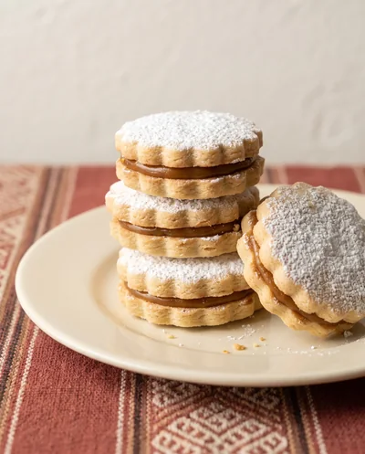 | **Top banner** Signature sweets, made the Peruvian way. | `generated/alfajores-1` | [`generated/alfajores-1.png`](../assets/generated/alfajores-1.png) |
| 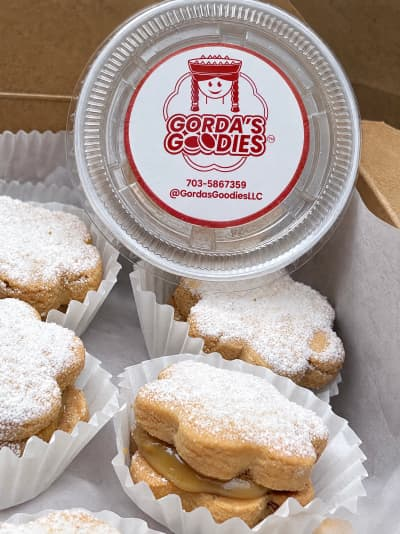 | **Top banner** Signature sweets, made the Peruvian way. | `closeup-gg-label` | [`Close-up cookie with GG Logo Label.jpg`](../assets/Close-up%20cookie%20with%20GG%20Logo%20Label.jpg) |
| 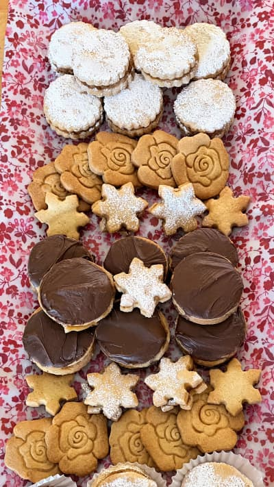 | **Fan Favorites — What people order again and again** Assorted Platters | `cookie-platter` | [`Cookie Platter 2.jpg`](../assets/Cookie%20Platter%202.jpg) |
| 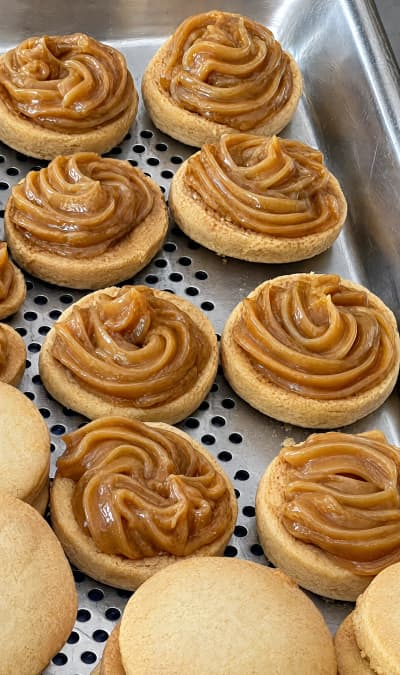 | **Fan Favorites — What people order again and again** Classic Alfajores | `closeup-batch-dulce` | [`close-up batch with dulce de leche.jpg`](../assets/close-up%20batch%20with%20dulce%20de%20leche.jpg) |
| 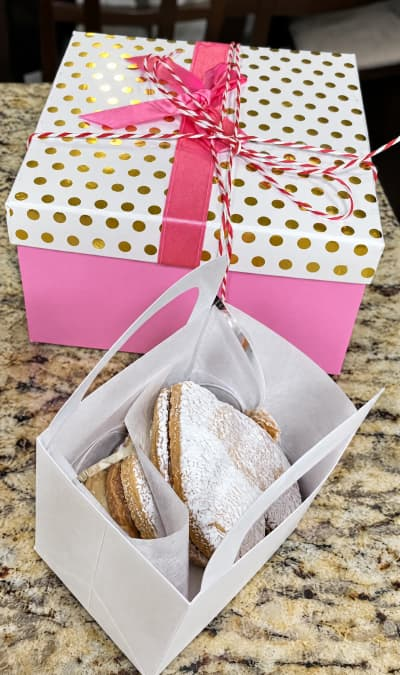 | **Fan Favorites — What people order again and again** Gift Boxes | `pink-gift-box` | [`Pink Gift Box of Alfajores.jpg`](../assets/Pink%20Gift%20Box%20of%20Alfajores.jpg) |
|  | **Our Story — A family recipe, shared one box at a time.** A box of Gorda's Goodies powdered-sugar alfajores with the brand label | `closeup-gg-label` | [`Close-up cookie with GG Logo Label.jpg`](../assets/Close-up%20cookie%20with%20GG%20Logo%20Label.jpg) |
|  | **Events & Custom Orders — Planning a party, wedding, or holiday spread?** A pink polka-dot gift box tied with ribbon, filled with alfajores | `pink-gift-box` | [`Pink Gift Box of Alfajores.jpg`](../assets/Pink%20Gift%20Box%20of%20Alfajores.jpg) |
| 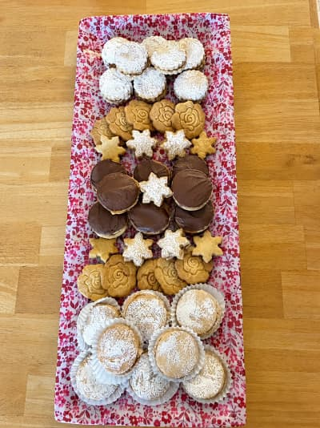 | **Gallery — From our kitchen to your table** Tray assortment of Gorda's Goodies cookies | `tray-assortment` | [`Tray assortment of GG cookies.jpg`](../assets/Tray%20assortment%20of%20GG%20cookies.jpg) |
| 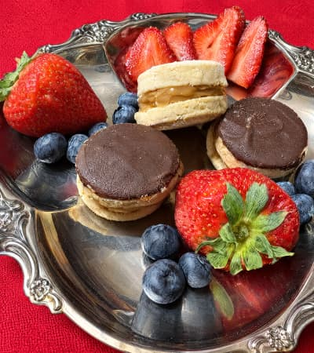 | **Gallery — From our kitchen to your table** Alfajores and strawberries served on a silver plate | `alfajores-strawberries` | [`Alfajores and Strawberries on silver plate.jpg`](../assets/Alfajores%20and%20Strawberries%20on%20silver%20plate.jpg) |
| 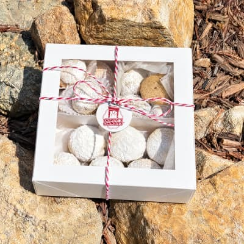 | **Gallery — From our kitchen to your table** Assorted box of goodies on stone rocks outdoors | `assorted-box-outdoors` | [`Assorted box on stone rocks.jpg`](../assets/Assorted%20box%20on%20stone%20rocks.jpg) |
| 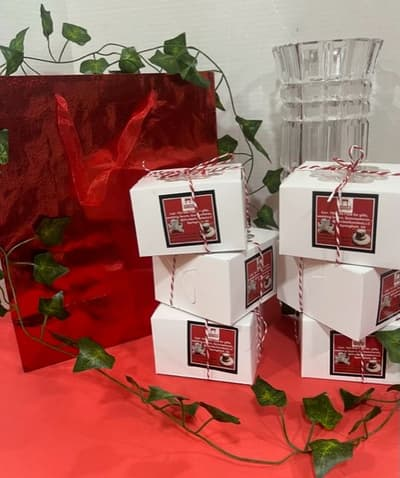 | **Gallery — From our kitchen to your table** Boxes of cookies stacked with a red gift bag | `boxes-stacked-red-bag` | [`Boxes Stacked with Red Bag.jpg`](../assets/Boxes%20Stacked%20with%20Red%20Bag.jpg) |

### About (4 photos)

| Photo | Where on the page | Name in `images/` | Original in `assets/` |
|---|---|---|---|
| 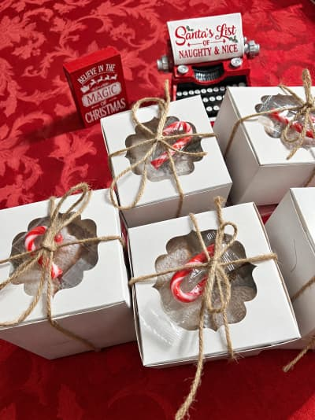 | **Top banner** The Gorda behind the Goodies. | `christmas-boxed-gifts` | [`Christmas Boxed Gifts with Candy Canes.jpg`](../assets/Christmas%20Boxed%20Gifts%20with%20Candy%20Canes.jpg) |
| 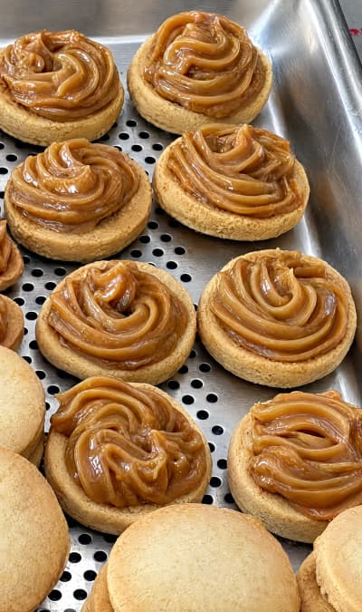 | **Our Vision — Bite-sized moments to treasure.** Homemade manjar blanco (dulce de leche) filling | `manjar-blanco-filling` | [`Manjar Blanco Filling.jpg`](../assets/Manjar%20Blanco%20Filling.jpg) |
|  | **Meet the Founder — Elsie Hasting** A box of Gorda's Goodies alfajores with the brand label | `closeup-gg-label` | [`Close-up cookie with GG Logo Label.jpg`](../assets/Close-up%20cookie%20with%20GG%20Logo%20Label.jpg) |
|  | **Custom Orders & Events — We cater for birthdays, showers, and every occasion in between.** An assorted box of Gorda's Goodies treats | `assorted-box-outdoors` | [`Assorted box on stone rocks.jpg`](../assets/Assorted%20box%20on%20stone%20rocks.jpg) |

### Menu (4 photos)

| Photo | Where on the page | Name in `images/` | Original in `assets/` |
|---|---|---|---|
|  | **Top banner** "What's Baking," Freshly Baked Custom Orders. | `generated/alfajores-1` | [`generated/alfajores-1.png`](../assets/generated/alfajores-1.png) |
|  | **Alfajores** Box of 6 | `closeup-batch-dulce` | [`close-up batch with dulce de leche.jpg`](../assets/close-up%20batch%20with%20dulce%20de%20leche.jpg) |
| 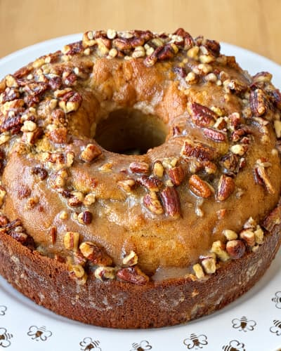 | **Cakes & Cupcakes** Crumb Cake | `crumbcake-vanilla-pecan` | [`Crumb Cake Vanilla Pecan Closeup.jpg`](../assets/Crumb%20Cake%20Vanilla%20Pecan%20Closeup.jpg) |
| 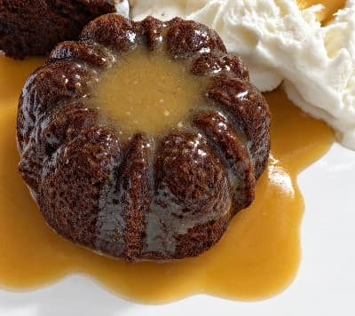 | **Cakes & Cupcakes** Sticky Toffee Cupcake | `sticky-toffee-pudding` | [`Sticky Toffee Pudding Cropped.jpg`](../assets/Sticky%20Toffee%20Pudding%20Cropped.jpg) |

### Events (15 photos)

| Photo | Where on the page | Name in `images/` | Original in `assets/` |
|---|---|---|---|
| 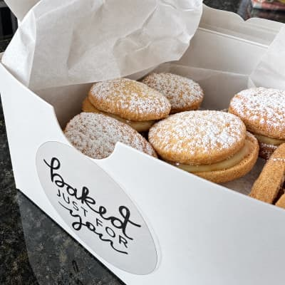 | **Top banner** GG Specialty Products at your next celebration? | `baked-just-for-you-box` | [`Baked Just For You Gift Box.jpg`](../assets/Baked%20Just%20For%20You%20Gift%20Box.jpg) |
|  | **Past Events — A look at what we've made** Boxes of alfajores stacked with a red gift bag | `boxes-stacked-red-bag` | [`Boxes Stacked with Red Bag.jpg`](../assets/Boxes%20Stacked%20with%20Red%20Bag.jpg) |
|  | **Past Events — A look at what we've made** Pink polka-dot gift box of alfajores | `pink-gift-box` | [`Pink Gift Box of Alfajores.jpg`](../assets/Pink%20Gift%20Box%20of%20Alfajores.jpg) |
|  | **Past Events — A look at what we've made** Assorted platter of alfajores | `cookie-platter` | [`Cookie Platter 2.jpg`](../assets/Cookie%20Platter%202.jpg) |
|  | **Past Events — A look at what we've made** Assorted box of goodies outdoors | `assorted-box-outdoors` | [`Assorted box on stone rocks.jpg`](../assets/Assorted%20box%20on%20stone%20rocks.jpg) |
|  | **Past Events — A look at what we've made** Tray assortment of Gorda's Goodies cookies | `tray-assortment` | [`Tray assortment of GG cookies.jpg`](../assets/Tray%20assortment%20of%20GG%20cookies.jpg) |
|  | **Past Events — A look at what we've made** Alfajores and strawberries on a silver plate | `alfajores-strawberries` | [`Alfajores and Strawberries on silver plate.jpg`](../assets/Alfajores%20and%20Strawberries%20on%20silver%20plate.jpg) |
| 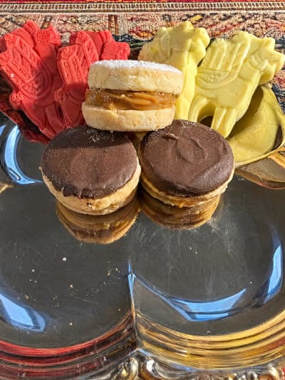 | **Past Events — A look at what we've made** Alfajores served with llama-shaped treats | `alfajores-llama-treats` | [`Alfajores and Red n White Llama.jpg`](../assets/Alfajores%20and%20Red%20n%20White%20Llama.jpg) |
|  | **Past Events — A look at what we've made** Close-up batch of alfajores with dulce de leche | `closeup-batch-dulce` | [`close-up batch with dulce de leche.jpg`](../assets/close-up%20batch%20with%20dulce%20de%20leche.jpg) |
| 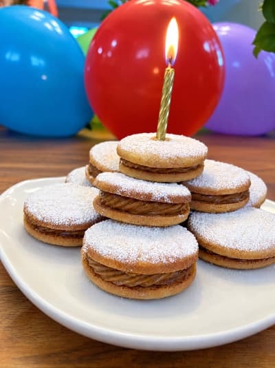 | **What We Cater — Occasions we love baking for** 🎉 Birthdays & Milestones | `birthday-candle-stack` | [`Birthday Stack of Alfajores.jpg`](../assets/Birthday%20Stack%20of%20Alfajores.jpg) |
| 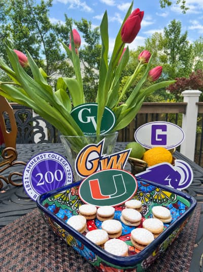 | **What We Cater — Occasions we love baking for** 🎓 Graduations | `graduation-tray` | [`Graduation Decals and Alfajores Tray.jpg`](../assets/Graduation%20Decals%20and%20Alfajores%20Tray.jpg) |
| 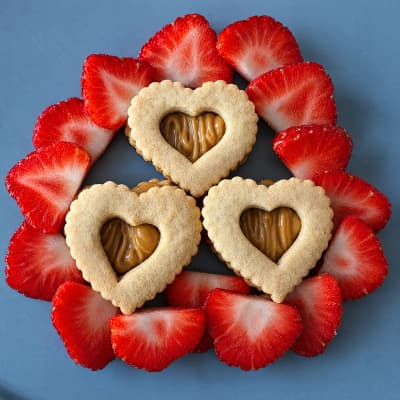 | **What We Cater — Occasions we love baking for** Weddings, Baby & Bridal Showers | `heart-alfajores-strawberries` | [`Heart Shaped Alfajores with Strawberries.jpg`](../assets/Heart%20Shaped%20Alfajores%20with%20Strawberries.jpg) |
|  | **What We Cater — Occasions we love baking for** 🎄 Holidays & Religious Events | `christmas-boxed-gifts` | [`Christmas Boxed Gifts with Candy Canes.jpg`](../assets/Christmas%20Boxed%20Gifts%20with%20Candy%20Canes.jpg) |
| 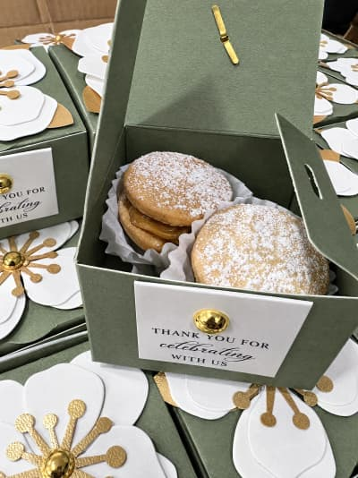 | **What We Cater — Occasions we love baking for** 🏆 Corporate & Dinner Parties | `celebrating-favor-box` | [`Thank You For Celebrating Favor Box.jpg`](../assets/Thank%20You%20For%20Celebrating%20Favor%20Box.jpg) |
| 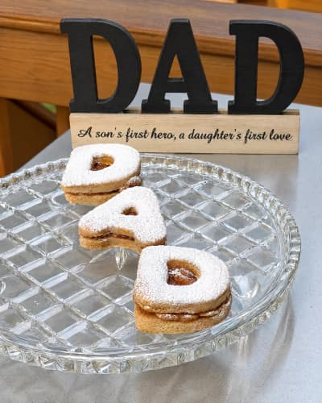 | **What We Cater — Occasions we love baking for** 🎊 Mother's Day, Father's Day & More | `dad-letter-cookies` | [`IMG_7857.jpg`](../assets/IMG_7857.jpg) |

### Gallery (32 photos)

| Photo | Where on the page | Name in `images/` | Original in `assets/` |
|---|---|---|---|
|  | **Top banner** From our kitchen to your table | `celebrating-favor-box` | [`Thank You For Celebrating Favor Box.jpg`](../assets/Thank%20You%20For%20Celebrating%20Favor%20Box.jpg) |
| 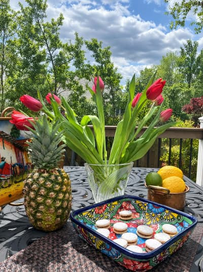 | **Photo grid (click to enlarge)** Alfajores on a Peruvian tray outdoors with tulips and pineapple | `hero-outdoor-tray` | [`Sun on Alfajores outside.jpg`](../assets/Sun%20on%20Alfajores%20outside.jpg) |
|  | **Photo grid (click to enlarge)** Assorted platter of alfajores including rose and star shapes | `cookie-platter` | [`Cookie Platter 2.jpg`](../assets/Cookie%20Platter%202.jpg) |
|  | **Photo grid (click to enlarge)** Tray assortment of Gorda's Goodies cookies | `tray-assortment` | [`Tray assortment of GG cookies.jpg`](../assets/Tray%20assortment%20of%20GG%20cookies.jpg) |
|  | **Photo grid (click to enlarge)** Box of alfajores with the Gorda's Goodies label | `closeup-gg-label` | [`Close-up cookie with GG Logo Label.jpg`](../assets/Close-up%20cookie%20with%20GG%20Logo%20Label.jpg) |
|  | **Photo grid (click to enlarge)** Pink polka-dot gift box of alfajores | `pink-gift-box` | [`Pink Gift Box of Alfajores.jpg`](../assets/Pink%20Gift%20Box%20of%20Alfajores.jpg) |
|  | **Photo grid (click to enlarge)** Boxes of cookies stacked with a red gift bag | `boxes-stacked-red-bag` | [`Boxes Stacked with Red Bag.jpg`](../assets/Boxes%20Stacked%20with%20Red%20Bag.jpg) |
|  | **Photo grid (click to enlarge)** Assorted box of goodies on stone rocks outdoors | `assorted-box-outdoors` | [`Assorted box on stone rocks.jpg`](../assets/Assorted%20box%20on%20stone%20rocks.jpg) |
|  | **Photo grid (click to enlarge)** Alfajores and strawberries on a silver plate | `alfajores-strawberries` | [`Alfajores and Strawberries on silver plate.jpg`](../assets/Alfajores%20and%20Strawberries%20on%20silver%20plate.jpg) |
| 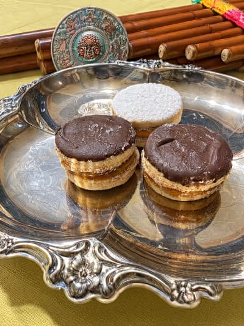 | **Photo grid (click to enlarge)** Alfajores served on a silver plate | `alfajores-silver-plate` | [`Alfajores and flue on silver plate.jpg`](../assets/Alfajores%20and%20flue%20on%20silver%20plate.jpg) |
|  | **Photo grid (click to enlarge)** Close-up batch of alfajores with dulce de leche | `closeup-batch-dulce` | [`close-up batch with dulce de leche.jpg`](../assets/close-up%20batch%20with%20dulce%20de%20leche.jpg) |
| 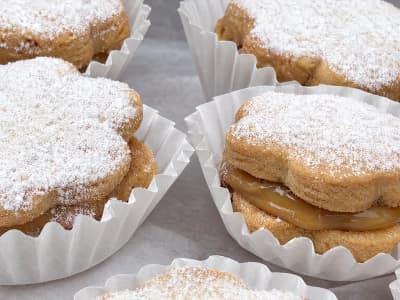 | **Photo grid (click to enlarge)** Close-up of an alfajor with the dulce de leche filling visible | `closeup-filling-visible` | [`Close-up alfa with filling visible.jpg`](../assets/Close-up%20alfa%20with%20filling%20visible.jpg) |
| 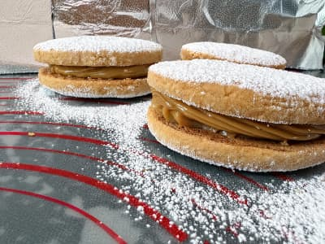 | **Photo grid (click to enlarge)** Inside view of an alfajor cookie | `inside-alfajor` | [`Inside Alfajor.jpg`](../assets/Inside%20Alfajor.jpg) |
| 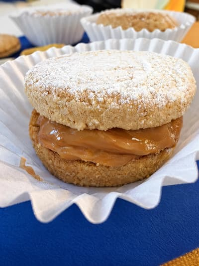 | **Photo grid (click to enlarge)** Close-up of a single alfajor | `one-alfajor-closeup` | [`One alfajor close-up.jpeg`](../assets/One%20alfajor%20close-up.jpeg) |
| 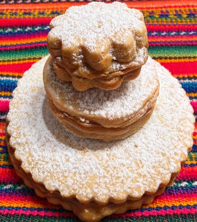 | **Photo grid (click to enlarge)** Alfajores shown in three different sizes | `three-sizes-closeup` | [`new close-up pic of 3 size alfajor.jpg`](../assets/new%20close-up%20pic%20of%203%20size%20alfajor.jpg) |
| 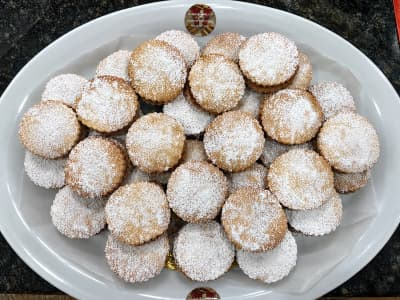 | **Photo grid (click to enlarge)** A fresh batch of cookies | `batch-of-cookies` | [`Batch of cookies.jpg`](../assets/Batch%20of%20cookies.jpg) |
|  | **Photo grid (click to enlarge)** Homemade manjar blanco filling | `manjar-blanco-filling` | [`Manjar Blanco Filling.jpg`](../assets/Manjar%20Blanco%20Filling.jpg) |
|  | **Photo grid (click to enlarge)** A mound of freshly made dulce de leche | `mound-dulce-de-leche` | [`Mound of Dulce De Leche.jpg`](../assets/Mound%20of%20Dulce%20De%20Leche.jpg) |
|  | **Photo grid (click to enlarge)** Alfajores served with red and white llama-shaped treats | `alfajores-llama-treats` | [`Alfajores and Red n White Llama.jpg`](../assets/Alfajores%20and%20Red%20n%20White%20Llama.jpg) |
| 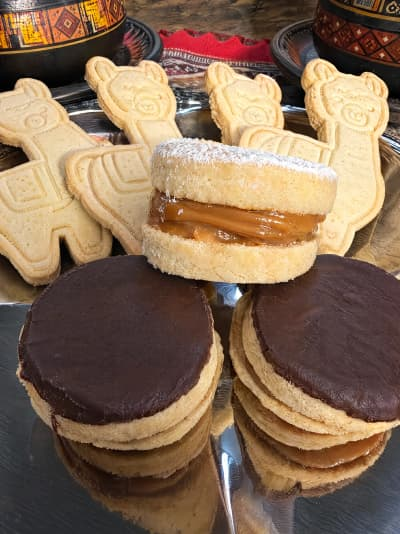 | **Photo grid (click to enlarge)** Alfajores with llama-shaped shortbread cookies | `alfajores-shortbread-llamas` | [`Alfajores and Shortbread Lllamas.jpg`](../assets/Alfajores%20and%20Shortbread%20Lllamas.jpg) |
|  | **Photo grid (click to enlarge)** An open gift box of powdered-sugar alfajores labeled 'Baked Just For You' | `baked-just-for-you-box` | [`Baked Just For You Gift Box.jpg`](../assets/Baked%20Just%20For%20You%20Gift%20Box.jpg) |
|  | **¡Qué rico! — Sweet inspiration** The signature stack | `generated/alfajores-1` | [`generated/alfajores-1.png`](../assets/generated/alfajores-1.png) |
| 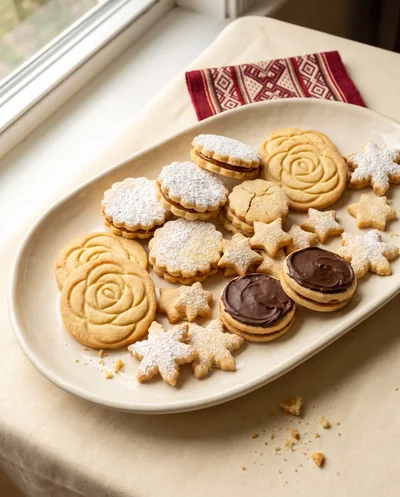 | **¡Qué rico! — Sweet inspiration** A celebration assortment | `generated/assortment/cookies-1` | [`generated/assortment/cookies-1.png`](../assets/generated/assortment/cookies-1.png) |
| 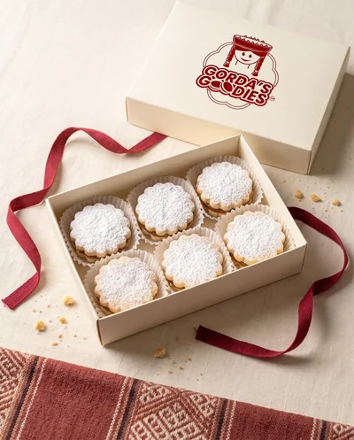 | **¡Qué rico! — Sweet inspiration** A little box of joy | `generated/packaging/box-3` | [`generated/packaging/box-3.png`](../assets/generated/packaging/box-3.png) |
| 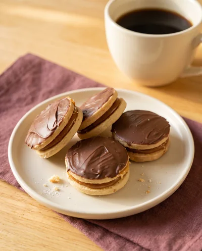 | **¡Qué rico! — Sweet inspiration** Chocolate, por favor | `generated/assortment/cookies-2` | [`generated/assortment/cookies-2.png`](../assets/generated/assortment/cookies-2.png) |
| 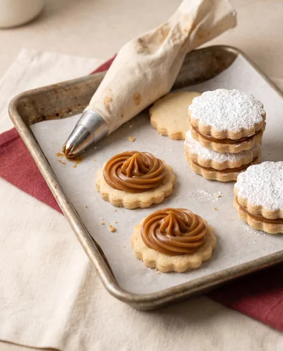 | **¡Qué rico! — Sweet inspiration** Filled with the good stuff | `generated/details/detail-1` | [`generated/details/detail-1.png`](../assets/generated/details/detail-1.png) |
| 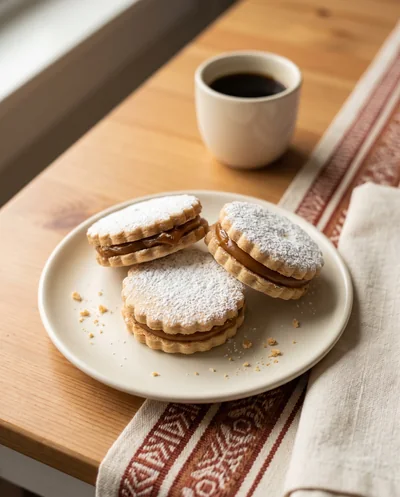 | **¡Qué rico! — Sweet inspiration** Coffee’s favorite companion | `generated/alfajores-2` | [`generated/alfajores-2.png`](../assets/generated/alfajores-2.png) |
| 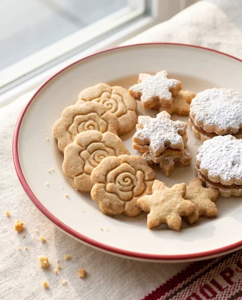 | **¡Qué rico! — Sweet inspiration** Flowers, stars &amp; sweet moments | `generated/assortment/cookies-3` | [`generated/assortment/cookies-3.png`](../assets/generated/assortment/cookies-3.png) |
| 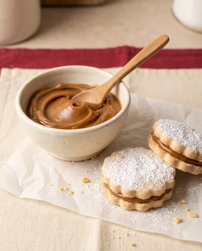 | **¡Qué rico! — Sweet inspiration** The heart of an alfajor | `generated/details/detail-2` | [`generated/details/detail-2.png`](../assets/generated/details/detail-2.png) |
| 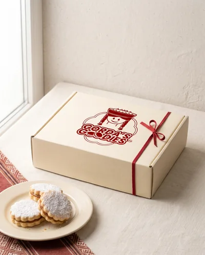 | **¡Qué rico! — Sweet inspiration** Goodies worth giving | `generated/packaging/box-1` | [`generated/packaging/box-1.png`](../assets/generated/packaging/box-1.png) |
| 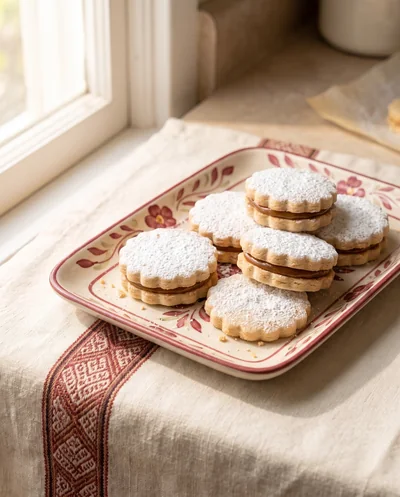 | **¡Qué rico! — Sweet inspiration** A little taste of Peru | `generated/details/detail-3` | [`generated/details/detail-3.png`](../assets/generated/details/detail-3.png) |
| 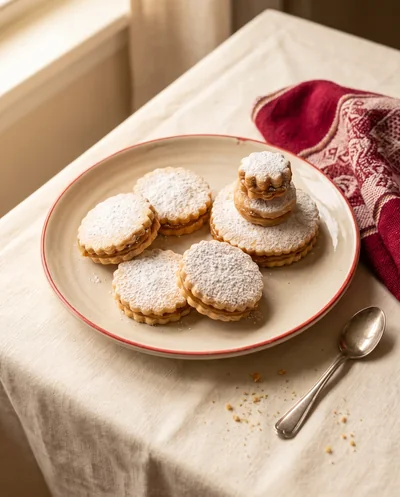 | **¡Qué rico! — Sweet inspiration** Made for sharing | `generated/alfajores-3` | [`generated/alfajores-3.png`](../assets/generated/alfajores-3.png) |

### Order (0 photos)

| Photo | Where on the page | Name in `images/` | Original in `assets/` |
|---|---|---|---|

## Every original, and where it's used

Sizes are the original's pixel dimensions. Anything under ~800px wide will look soft if used as a full-width banner — fine for thumbnails and cards.

| Photo | Original in `assets/` | Name in `images/` | Size | Used on |
|---|---|---|---|---|
|  | [`Alfajores and Red n White Llama.jpg`](../assets/Alfajores%20and%20Red%20n%20White%20Llama.jpg) | `alfajores-llama-treats` | 240×320 ⚠️ low-res | Events, Gallery |
|  | [`Alfajores and Shortbread Lllamas.jpg`](../assets/Alfajores%20and%20Shortbread%20Lllamas.jpg) | `alfajores-shortbread-llamas` | 240×320 ⚠️ low-res | Gallery |
|  | [`Alfajores and flue on silver plate.jpg`](../assets/Alfajores%20and%20flue%20on%20silver%20plate.jpg) | `alfajores-silver-plate` | 240×320 ⚠️ low-res | Gallery |
|  | [`Alfajores and Strawberries on silver plate.jpg`](../assets/Alfajores%20and%20Strawberries%20on%20silver%20plate.jpg) | `alfajores-strawberries` | 286×320 ⚠️ low-res | Home, Events, Gallery |
|  | [`Assorted box on stone rocks.jpg`](../assets/Assorted%20box%20on%20stone%20rocks.jpg) | `assorted-box-outdoors` | 308×320 ⚠️ low-res | Home, About, Events, Gallery |
| 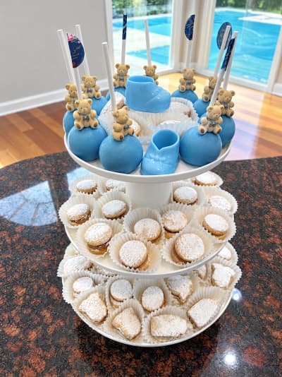 | [`Baby Shower Tower of Alfajores.jpg`](../assets/Baby%20Shower%20Tower%20of%20Alfajores.jpg) | `baby-shower-tower` | 480×640 ⚠️ low-res | **Not used** |
|  | [`Baked Just For You Gift Box.jpg`](../assets/Baked%20Just%20For%20You%20Gift%20Box.jpg) | `baked-just-for-you-box` | 1512×1587 | Events, Gallery |
|  | [`Batch of cookies.jpg`](../assets/Batch%20of%20cookies.jpg) | `batch-of-cookies` | 640×480 ⚠️ low-res | Gallery |
|  | [`Birthday Stack of Alfajores.jpg`](../assets/Birthday%20Stack%20of%20Alfajores.jpg) | `birthday-candle-stack` | 480×640 ⚠️ low-res | Events |
|  | [`Boxes Stacked with Red Bag.jpg`](../assets/Boxes%20Stacked%20with%20Red%20Bag.jpg) | `boxes-stacked-red-bag` | 536×640 ⚠️ low-res | Home, Events, Gallery |
|  | [`Thank You For Celebrating Favor Box.jpg`](../assets/Thank%20You%20For%20Celebrating%20Favor%20Box.jpg) | `celebrating-favor-box` | 1512×2016 | Events, Gallery |
|  | [`Christmas Boxed Gifts with Candy Canes.jpg`](../assets/Christmas%20Boxed%20Gifts%20with%20Candy%20Canes.jpg) | `christmas-boxed-gifts` | 1512×2016 | About, Events |
|  | [`close-up batch with dulce de leche.jpg`](../assets/close-up%20batch%20with%20dulce%20de%20leche.jpg) | `closeup-batch-dulce` | 814×1280 | Home, Menu, Events, Gallery |
|  | [`Close-up alfa with filling visible.jpg`](../assets/Close-up%20alfa%20with%20filling%20visible.jpg) | `closeup-filling-visible` | 480×640 ⚠️ low-res | Gallery |
|  | [`Close-up cookie with GG Logo Label.jpg`](../assets/Close-up%20cookie%20with%20GG%20Logo%20Label.jpg) | `closeup-gg-label` | 1512×2016 | Home, About, Gallery |
|  | [`Cookie Platter 2.jpg`](../assets/Cookie%20Platter%202.jpg) | `cookie-platter` | 1461×2628 | Home, Events, Gallery |
| 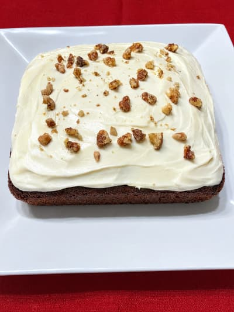 | [`GG Crumb Cake Frosted Square.jpg`](../assets/GG%20Crumb%20Cake%20Frosted%20Square.jpg) | `crumbcake-frosted-square` | 487×640 ⚠️ low-res | **Not used** |
|  | [`Crumb Cake Vanilla Pecan Closeup.jpg`](../assets/Crumb%20Cake%20Vanilla%20Pecan%20Closeup.jpg) | `crumbcake-vanilla-pecan` | 864×1080 | Menu |
|  | [`IMG_7857.jpg`](../assets/IMG_7857.jpg) | `dad-letter-cookies` | 873×1034 | Events |
|  | [`generated/alfajores-1.png`](../assets/generated/alfajores-1.png) | `generated/alfajores-1` | 1856×2304 | Home, Menu, Gallery |
|  | [`generated/alfajores-2.png`](../assets/generated/alfajores-2.png) | `generated/alfajores-2` | 1856×2304 | Gallery |
|  | [`generated/alfajores-3.png`](../assets/generated/alfajores-3.png) | `generated/alfajores-3` | 1856×2304 | Gallery |
|  | [`generated/assortment/cookies-1.png`](../assets/generated/assortment/cookies-1.png) | `generated/assortment/cookies-1` | 1856×2304 | Gallery |
|  | [`generated/assortment/cookies-2.png`](../assets/generated/assortment/cookies-2.png) | `generated/assortment/cookies-2` | 1856×2304 | Gallery |
|  | [`generated/assortment/cookies-3.png`](../assets/generated/assortment/cookies-3.png) | `generated/assortment/cookies-3` | 1856×2304 | Gallery |
|  | [`generated/details/detail-1.png`](../assets/generated/details/detail-1.png) | `generated/details/detail-1` | 1856×2304 | Gallery |
|  | [`generated/details/detail-2.png`](../assets/generated/details/detail-2.png) | `generated/details/detail-2` | 1856×2304 | Gallery |
|  | [`generated/details/detail-3.png`](../assets/generated/details/detail-3.png) | `generated/details/detail-3` | 1856×2304 | Gallery |
|  | [`generated/packaging/box-1.png`](../assets/generated/packaging/box-1.png) | `generated/packaging/box-1` | 1856×2304 | Gallery |
| 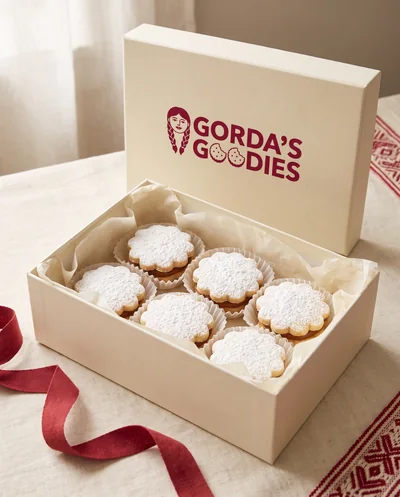 | [`generated/packaging/box-2.png`](../assets/generated/packaging/box-2.png) | `generated/packaging/box-2` | 1856×2304 | **Not used** |
| 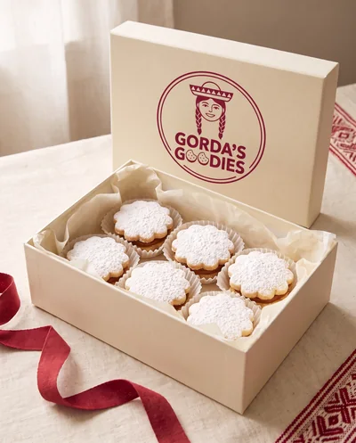 | [`generated/packaging/box-2-refined.png`](../assets/generated/packaging/box-2-refined.png) | `generated/packaging/box-2-refined` | 1856×2304 | **Not used** |
|  | [`generated/packaging/box-3.png`](../assets/generated/packaging/box-3.png) | `generated/packaging/box-3` | 1856×2304 | Gallery |
|  | [`Graduation Decals and Alfajores Tray.jpg`](../assets/Graduation%20Decals%20and%20Alfajores%20Tray.jpg) | `graduation-tray` | 1512×2016 | Events |
|  | [`Heart Shaped Alfajores with Strawberries.jpg`](../assets/Heart%20Shaped%20Alfajores%20with%20Strawberries.jpg) | `heart-alfajores-strawberries` | 1157×1140 | Events |
|  | [`Sun on Alfajores outside.jpg`](../assets/Sun%20on%20Alfajores%20outside.jpg) | `hero-outdoor-tray` | 2679×3778 | Gallery |
|  | [`Inside Alfajor.jpg`](../assets/Inside%20Alfajor.jpg) | `inside-alfajor` | 640×480 ⚠️ low-res | Gallery |
|  | [`Manjar Blanco Filling.jpg`](../assets/Manjar%20Blanco%20Filling.jpg) | `manjar-blanco-filling` | 814×1280 | About, Gallery |
| 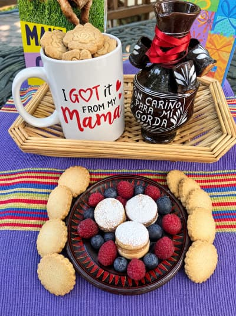 | [`Mothers Day I Got It From My Mama.jpg`](../assets/Mothers%20Day%20I%20Got%20It%20From%20My%20Mama.jpg) | `mothersday-mama-mug` | 1512×2016 | **Not used** |
|  | [`Mound of Dulce De Leche.jpg`](../assets/Mound%20of%20Dulce%20De%20Leche.jpg) | `mound-dulce-de-leche` | 814×1280 | Gallery |
|  | [`One alfajor close-up.jpeg`](../assets/One%20alfajor%20close-up.jpeg) | `one-alfajor-closeup` | 240×320 ⚠️ low-res | Gallery |
|  | [`Pink Gift Box of Alfajores.jpg`](../assets/Pink%20Gift%20Box%20of%20Alfajores.jpg) | `pink-gift-box` | 389×640 ⚠️ low-res | Home, Events, Gallery |
|  | [`Sticky Toffee Pudding Cropped.jpg`](../assets/Sticky%20Toffee%20Pudding%20Cropped.jpg) | `sticky-toffee-pudding` | 2350×2100 | Menu |
|  | [`new close-up pic of 3 size alfajor.jpg`](../assets/new%20close-up%20pic%20of%203%20size%20alfajor.jpg) | `three-sizes-closeup` | 1183×1280 | Gallery |
|  | [`Tray assortment of GG cookies.jpg`](../assets/Tray%20assortment%20of%20GG%20cookies.jpg) | `tray-assortment` | 480×640 ⚠️ low-res | Home, Events, Gallery |

## Not currently on any page

These are processed and ready in `images/` but no page shows them right now — safe to use, or to remove from `build-images.js` if they're not wanted.

- [`Baby Shower Tower of Alfajores.jpg`](../assets/Baby%20Shower%20Tower%20of%20Alfajores.jpg) → `baby-shower-tower`
- [`GG Crumb Cake Frosted Square.jpg`](../assets/GG%20Crumb%20Cake%20Frosted%20Square.jpg) → `crumbcake-frosted-square`
- [`generated/packaging/box-2.png`](../assets/generated/packaging/box-2.png) → `generated/packaging/box-2`
- [`generated/packaging/box-2-refined.png`](../assets/generated/packaging/box-2-refined.png) → `generated/packaging/box-2-refined`
- [`Mothers Day I Got It From My Mama.jpg`](../assets/Mothers%20Day%20I%20Got%20It%20From%20My%20Mama.jpg) → `mothersday-mama-mug`

### Other files in `assets/`

Not in the `photos` map, so they don't get web sizes generated:

- [`Final_Original_GordasGoodies.png`](../assets/Final_Original_GordasGoodies.png) — Logo master. Becomes the header/footer logo and favicons (see "Site-wide").
- [`sticky date.jpg`](../assets/sticky%20date.jpg) — Uncropped original of "Sticky Toffee Pudding Cropped.jpg" (the crop is what the site uses).

## Site-wide

| Image | Files | Where |
|---|---|---|
|  | `logo-crisp-320.png` (also `logo-crisp-640.png`, `logo-crisp-1280.png`) | Header and footer, every page |
|  | `favicon-32.png`, `apple-touch-icon.png`, `favicon-512.png` | Browser tab icon / phone home-screen icon |

All of these come from [`Final_Original_GordasGoodies.png`](../assets/Final_Original_GordasGoodies.png).
